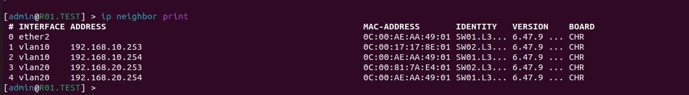
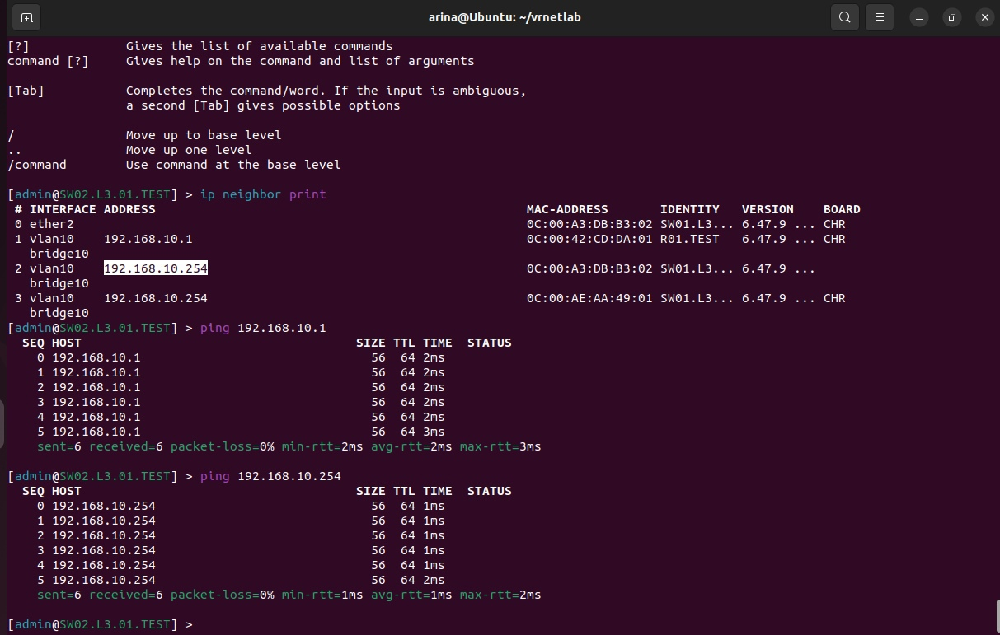

<p>University: [ITMO University](https://itmo.ru/ru/)</p>
<p></p>Faculty: [FICT](https://fict.itmo.ru)</p>
<p>Course: [Introduction in routing](https://github.com/itmo-ict-faculty/introduction-in-routing)</p>
<p>Year: 2023/2024</p>
<p>Group: K33202</p>
<p>Author: Gusevskaya Arina Eduardovna</p>
<p>Lab: Lab1</p>
<p>Date of create: 01.10.2023</p>
<p>Date of finished: ..2023</p>

<p align="center"> <h2> Отчёт по лабораторной работе №1 "Установка ContainerLab и развертывание тестовой сети связи"</h2> </p>
<p><b>Цель:</b> Ознакомиться с инструментом ContainerLab и методами работы с ним, изучить работу VLAN, IP адресации и т.д.
<p><b>Ход работы:</b>
<p>1. На подготовительном этапе лабораторной работы нами были выполнены следующие шаги.
  <p>• Установлен Docker на рабочий компьютер
  <p>• Установлен make и склонирован hellt/vrnetlab
  <p> • В проект hellt/vrnetlab в папку routeros загружен chr-6.47.9.vmdk и с помощью make docker-image собран образ.
  <p>•	Установлен ContainerLab 
<p>2. Основная часть работы
<h3>Топологии</h3>
<p>Для лучшего понимания разберемся, что значит каждый элемент топологии
<p>name (имя) - используется для отличия одной топологии от другой, чтобы разрешить развертывание нескольких топологий на одном хосте без конфликтов.
<p>topology (топология) - основной элемент файла (тело), который включает в себя строительные блоки nodes, kinds, defaults и links.
<p>nodes (узлы) - с помощью них мы определяем характеристики и конфигурацию элементов, которые хотим запустить.
<p>links (связи) - служит для определения связи между элементами.
<p>kinds (виды) - определяют поведение и природу узла, это говорит о том, является ли узел конкретной операционной системой контейнерной сети, виртуализированным маршрутизатором или чем-то еще.
<p>С поддердиваемыми kinds я ознакомилась в источнике https://containerlab.dev/manual/kinds/ и для лабораторной работы выбрала vr-ros(роутер и свичи) и linux (ПК)
<h3>Выполнение</h3>
<p>1. Создадим трехуровневую сеть связи классического предприятия изображенную на рисунке 1 (из задания) в ContainerLab. Для этого пропишем топологию в файле lab1.yaml.
  
```
name: lab1

mgmt:
  network: statics
  ipv4-subnet: 172.20.15.0/24

topology: 

  nodes:
    R01.TEST: 
      kind: vr-ros
      image: vrnetlab/vr-routeros:6.47.9
      mgmt-ipv4: 172.20.15.12

    SW01.L3.01.TEST:
      kind: vr-ros
      image: vrnetlab/vr-routeros:6.47.9
      mgmt-ipv4: 172.20.15.13

    SW02.L3.01.TEST:
      kind: vr-ros
      image: vrnetlab/vr-routeros:6.47.9
      mgmt-ipv4: 172.20.15.14

    SW02.L3.02.TEST:
      kind: vr-ros
      image: vrnetlab/vr-routeros:6.47.9
      mgmt-ipv4: 172.20.15.15

    PC1:
      kind: linux
      image: alpine:latest
      mgmt-ipv4: 172.20.15.16

    PC2:
      kind: linux
      image: ubuntu:latest
      mgmt-ipv4: 172.20.15.17

  links: 
    - endpoints: ["R01.TEST:eth1","SW01.L3.01.TEST:eth1"] 
    - endpoints: ["SW01.L3.01.TEST:eth2","SW02.L3.01.TEST:eth1"] 
    - endpoints: ["SW01.L3.01.TEST:eth3","SW02.L3.02.TEST:eth1"] 
    - endpoints: ["SW02.L3.01.TEST:eth2","PC1:eth1"] 
    - endpoints: ["SW02.L3.02.TEST:eth2","PC2:eth1"] 
```
<p> С помощью команды ```clab deploy --topo lab1.yaml``` развернем лабораторию. На выходе получим 6 контейнеров.
<p>
<p>2. Создадим схему связи, используя drawio</p>
<p align="center">

<p>3. Перейдем к настройке оборудования:

<h5>R01.TEST</h5>

```
/interface vlan
add interface=ether2 name=vlan10 vlan-id=10
add interface=ether2 name=vlan20 vlan-id=20
/interface wireless security-profiles
set [ find default=yes ] supplicant-identity=MikroTik
/ip pool
add name=pool10 ranges=192.168.10.10-192.168.10.254
add name=pool20 ranges=192.168.20.10-192.168.20.254
/ip dhcp-server
add address-pool=pool10 disabled=no interface=vlan10 name=dhcp10
add address-pool=pool20 disabled=no interface=vlan20 name=dhcp20
/ip address
add address=172.31.255.30/30 interface=ether1 network=172.31.255.28
add address=192.168.10.1/24 interface=vlan10 network=192.168.10.0
add address=192.168.20.1/24 interface=vlan20 network=192.168.20.0
/ip dhcp-client
add disabled=no interface=ether1
/ip dhcp-server network
add address=192.168.10.0/24 gateway=192.168.10.1
add address=192.168.20.0/24 gateway=192.168.20.1
/system identity
set name=R01.TEST
```
<p>1. Cоздадим два виртуальных интерфейса VLAN на физическом интерфейсе ether2 с идентификаторами vlan10 и vlan20.
<p>2. Для каждого vlan создадим пул адресов DHCP: pool10 и pool20 соответственно.
<p>3. Создадим два DHCP-сервера для выдачи ip-адресов из пула, каждый из которых связан с соответствующим интерфейсом vlan.

<h5>SW01.L3.01.TEST</h5>

```
/interface bridge
add name=bridge10
add name=bridge20
/interface vlan
add interface=ether2 name=vlan10 vlan-id=10
add interface=ether2 name=vlan20 vlan-id=20
add interface=ether3 name=vlan100 vlan-id=10
add interface=ether4 name=vlan200 vlan-id=20
/interface wireless security-profiles
set [ find default=yes ] supplicant-identity=MikroTik
/interface bridge port
add bridge=bridge10 interface=vlan10
add bridge=bridge20 interface=vlan20
add bridge=bridge10 interface=vlan100
add bridge=bridge20 interface=vlan200
/ip address
add address=172.31.255.30/30 interface=ether1 network=172.31.255.28
/ip dhcp-client
add disabled=no interface=ether1
add disabled=no interface=bridge10
add disabled=no interface=bridge20
/system identity
set name=SW01.L3.01.TEST
```
<p>1. Создадим мост "bridge", объединяющий vlan10 и vlan20.
<p>2. Включеним DHCP-клиент на интерфейсе "ether1".
  
<h5>SW02.L3.01.TEST</h5>
  
```
/interface bridge
add name=bridge10
/interface vlan
add interface=ether2 name=vlan10 vlan-id=10
/interface wireless security-profiles
set [ find default=yes ] supplicant-identity=MikroTik
/interface bridge port
add bridge=bridge10 interface=vlan10
add bridge=bridge10 interface=ether3
/ip address
add address=172.31.255.30/30 interface=ether1 network=172.31.255.28
/ip dhcp-client
add disabled=no interface=ether1
add disabled=no interface=bridge10
/system identity
set name=SW02.L3.01.TEST
```
<h5>SW02.L3.02.TEST</h5>

```
/interface bridge
add name=bridge20
/interface vlan
add interface=ether2 name=vlan20 vlan-id=20
/interface wireless security-profiles
set [ find default=yes ] supplicant-identity=MikroTik
/interface bridge port
add bridge=bridge20 interface=vlan20
add bridge=bridge20 interface=ether3
/ip address
add address=172.31.255.30/30 interface=ether1 network=172.31.255.28
/ip dhcp-client
add disabled=no interface=ether1
add disabled=no interface=bridge20
/system identity
set name=SW02.L3.02.TEST
```
<h3>Проверка целостности сети</h3>
<p>1. Выведем адреса интерфейсов
<p align="center">
 
</p>
<p>2. Проверим доступность устройств, пропинговав их
<p align="center">
 
</p>
<p align="center">Пинги с роутера на PC
<p align="center">
 
</p>
<p align="center">Пинги с свича второго уровня на роутер
<p align="center">
 
</p>
<p align="center">Пинги с свича второго уровня на PC
<p><b>Вывод:</b> В ходе работы были получены навыки создания виртуализированных контейнеров с помощью Docker и ContainerLab. Произведена настройка VLAN, IP адресации, DHCP.
