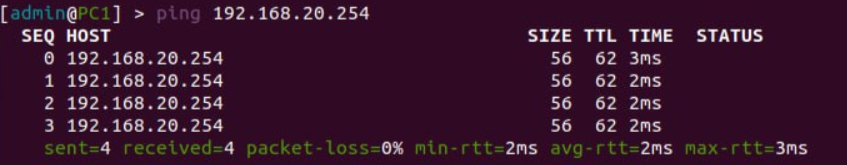
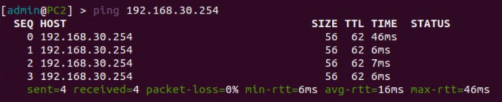
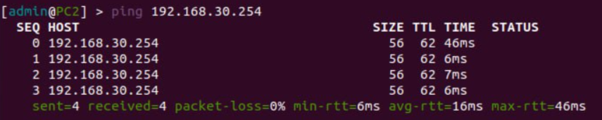

<p>University: [ITMO University](https://itmo.ru/ru/)</p>
<p></p>Faculty: [FICT](https://fict.itmo.ru)</p>
<p>Course: [Introduction in routing](https://github.com/itmo-ict-faculty/introduction-in-routing)</p>
<p>Year: 2023/2024</p>
<p>Group: K33202</p>
<p>Author: Gusevskaya Arina Eduardovna</p>
<p>Lab: Lab2</p>
<p>Date of create: 01.11.2023</p>
<p>Date of finished: 11.12.2023</p>

<p align="center"> <h2> Отчёт по лабораторной работе №2 "Эмуляция распределенной корпоративной сети связи, настройка статической маршрутизации между филиалами"</h2> </p>
<p><b>Цель:</b> Ознакомиться с принципами планирования IP адресов, настройке статической маршрутизации и сетевыми функциями устройств.
<p><b>Ход работы:</b>
<p>1. В ходе первой лабораторной работы были выполнены все подготовительные шаги, ничего устанавливать не нужно</p>
<p>2. Чтобы не образовалось конфликта сетей, были остановлены и удалены контейнеры из предыдущей лабораторной работы</p>
<p align="center">
 
</p>
<p>3. Были прописаны те же топологии, но изменены устройства</p>
<h3>Выполнение</h3>
<p>1. Создадим сеть связи изображенную на рисунке 1 (из задания) в ContainerLab. Для этого пропишем топологию в файле lab2.yaml.
  
```
name: lab2

mgmt:
  network: statics
  ipv4-subnet: 172.20.15.0/24

topology:

  nodes:
    R01.MSK:
      kind: vr-ros
      image: vrnetlab/vr-routeros:6.47.9
      mgmt-ipv4: 172.20.15.12

    R01.BRL:
      kind: vr-ros
      image: vrnetlab/vr-routeros:6.47.9
      mgmt-ipv4: 172.20.15.13

    R01.FRT:
      kind: vr-ros
      image: vrnetlab/vr-routeros:6.47.9
      mgmt-ipv4: 172.20.15.14

    PC1:
      kind: linux
      image: alpine:latest
      mgmt-ipv4: 172.20.15.15

    PC2:
      kind: linux
      image: alpine:latest
      mgmt-ipv4: 172.20.15.16

    PC3:
      kind: linux
      image: ubuntu:latest
      mgmt-ipv4: 172.20.15.17

  links:
    - endpoints: ["R01.MSK:eth2", "R01.FRT:eth2"]
    - endpoints: ["R01.MSK:eth1", "R01.BRL:eth1"]
    - endpoints: ["R01.BRL:eth2", "R01.FRT:eth1"]
    - endpoints: ["R01.MSK:eth3", "PC1:eth3"]
    - endpoints: ["R01.FRT:eth3", "PC2:eth3"]
    - endpoints: ["R01.BRL:eth3", "PC3:eth3"]
```
<p>2. С помощью команды ```clab deploy --topo lab2.yaml``` развернем лабораторию. На выходе получим 6 контейнеров.
<p align="center">
 
</p> 
<p>3. Создадим схему связи, используя drawio
<p align="center">
 
</p>
<p>4. Перейдем к настройке оборудования
<h5>R01.MSK</h5>

```
/interface wireless security-profiles
set [ find default=yes ] supplicant-identity=MikroTik
/ip pool
add name=pool1 ranges=192.168.10.2-192.168.10.254
/ip dhcp-server
add address-pool=pool1 disabled=no interface=ether4 name=dhcp10
/ip address
add address=172.31.255.30/30 interface=ether1 network=172.31.255.28
add address=192.168.10.1/24 interface=ether4 network=192.168.10.0
add address=10.10.1.1/30 interface=ether2 network=10.10.1.0
add address=10.10.2.2/30 interface=ether3 network=10.10.2.0
/ip dhcp-client
add disabled=no interface=ether1
/ip dhcp-server network
add address=192.168.10.0/24 gateway=192.168.10.1
/ip route
add distance=1 dst-address=192.168.20.0/24 gateway=10.10.2.1
add distance=1 dst-address=192.168.30.0/24 gateway=10.10.1.2
/system identity
set name=R01.MSK
```
<p>1. Настроим DHCP-сервер на ether4.
<p>2. На интерфейсах, которые связаны с другими роутерами, настроим статические ip-адреса. 
<p>3. Изменим имя устройства.

<h5>R01.FRT</h5>

```
/interface wireless security-profiles
set [ find default=yes ] supplicant-identity=MikroTik
/ip pool
add name=pool20 ranges=192.168.20.2-192.168.20.254
/ip dhcp-server
add address-pool=pool20 disabled=no interface=ether4 name=dhcp20
/ip address
add address=172.31.255.30/30 interface=ether1 network=172.31.255.28
add address=192.168.20.1/24 interface=ether4 network=192.168.20.0
add address=10.10.2.1/30 interface=ether3 network=10.10.2.0
add address=10.10.3.2/30 interface=ether2 network=10.10.3.0
/ip dhcp-client
add disabled=no interface=ether1
/ip dhcp-server network
add address=192.168.20.0/24 gateway=192.168.20.1
/ip route
add distance=1 dst-address=192.168.10.0/24 gateway=10.10.2.2
add distance=1 dst-address=192.168.30.0/24 gateway=10.10.3.1
/system identity
set name=R01.FRT
```
<p>Настройка аналогичная предыдущему роутеру.
  
<h5>R01.BRL</h5>
  
```
/interface wireless security-profiles
set [ find default=yes ] supplicant-identity=MikroTik
/ip pool
add name=pool30 ranges=192.168.30.2-192.168.30.254
/ip dhcp-server
add address-pool=pool30 disabled=no interface=ether4 name=dhcp30
/ip address
add address=172.31.255.30/30 interface=ether1 network=172.31.255.28
add address=192.168.30.1/24 interface=ether4 network=192.168.30.0
add address=10.10.1.2/30 interface=ether2 network=10.10.1.0
add address=10.10.3.1/30 interface=ether3 network=10.10.3.0
/ip dhcp-client
add disabled=no interface=ether1
/ip dhcp-server network
add address=192.168.30.0/24 gateway=192.168.30.1
/ip route
add distance=1 dst-address=192.168.10.0/24 gateway=10.10.1.1
add distance=1 dst-address=192.168.20.0/24 gateway=10.10.3.2
/system identity
set name=R01.BRL
```
<h5>PC1</h5>

```
/interface wireless security-profiles
set [ find default=yes ] supplicant-identity=MikroTik
/ip address
add address=172.31.255.30/30 interface=ether1 network=172.31.255.28
/ip dhcp-client
add disabled=no interface=ether1
add disabled=no interface=ether2
/ip route
add distance=1 dst-address=10.10.1.0/30 gateway=192.168.10.1
add distance=1 dst-address=10.10.2.0/30 gateway=192.168.10.1
add distance=1 dst-address=192.168.20.0/24 gateway=192.168.10.1
add distance=1 dst-address=192.168.30.0/24 gateway=192.168.10.1
/system identity
set name=PC1
```
<p>1. Включим DHCP-клиент на ether2
<p>2. Конфигурации PC2 и PC3 прописываются аналогично.

<h5>PC2</h5>

```
/interface wireless security-profiles
set [ find default=yes ] supplicant-identity=MikroTik
/ip address
add address=172.31.255.30/30 interface=ether1 network=172.31.255.28
/ip dhcp-client
add disabled=no interface=ether1
add disabled=no interface=ether2
/ip route
add distance=1 dst-address=10.10.2.0/30 gateway=192.168.20.1
add distance=1 dst-address=10.10.3.0/30 gateway=192.168.20.1
add distance=1 dst-address=192.168.10.0/24 gateway=192.168.20.1
add distance=1 dst-address=192.168.30.0/24 gateway=192.168.20.1
/system identity
set name=PC2
```
<h5>PC3</h5>

```
/interface wireless security-profiles
set [ find default=yes ] supplicant-identity=MikroTik
/ip address
add address=172.31.255.30/30 interface=ether1 network=172.31.255.28
/ip dhcp-client
add disabled=no interface=ether1
add disabled=no interface=ether2
/ip route
add distance=1 dst-address=10.10.1.0/30 gateway=192.168.10.1
add distance=1 dst-address=10.10.3.0/30 gateway=192.168.10.1
add distance=1 dst-address=192.168.10.0/24 gateway=192.168.10.1
add distance=1 dst-address=192.168.20.0/24 gateway=192.168.10.1
/system identity
set name=PC3
```
 
<h3>Проверка целостности сети</h3>
<p>5. Проверим доступность устройств, пропинговав их
<p align="center">
 
</p>
<p align="center">Пинг c PC1 на PC2
<p align="center">
 
</p>
<p align="center">Пинг c PC1 на PC3
<p align="center">
 
</p>
<p align="center">Пинг c PC2 на PC3
<p><b>Вывод:</b> В ходе данной лабораторной работы мы изучили принципы планирования IP адресов, настройку статической маршрутизации и сетевые функции устройств.
