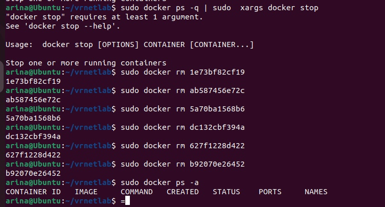
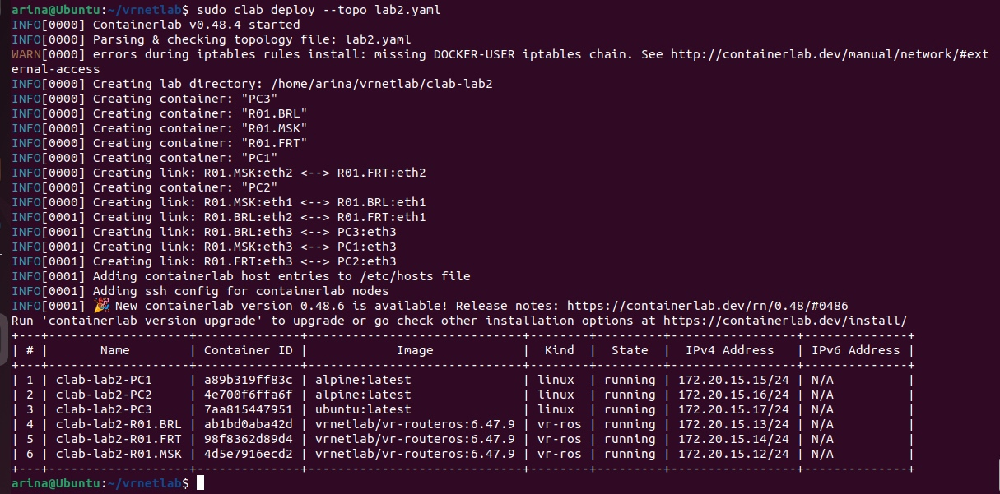
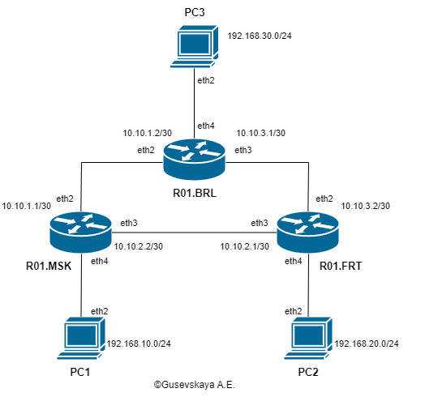

<p>University: [ITMO University](https://itmo.ru/ru/)</p>
<p></p>Faculty: [FICT](https://fict.itmo.ru)</p>
<p>Course: [Introduction in routing](https://github.com/itmo-ict-faculty/introduction-in-routing)</p>
<p>Year: 2023/2024</p>
<p>Group: K33202</p>
<p>Author: Gusevskaya Arina Eduardovna</p>
<p>Lab: Lab1</p>
<p>Date of create: 01.11.2023</p>
<p>Date of finished: 11.12.2023</p>

<p align="center"> <h2> Отчёт по лабораторной работе №2 "Эмуляция распределенной корпоративной сети связи, настройка статической маршрутизации между филиалами"</h2> </p>
<p><b>Цель:</b> Ознакомиться с принципами планирования IP адресов, настройке статической маршрутизации и сетевыми функциями устройств.
<p><b>Ход работы:</b>
<p>1. В ходе первой лабораторной работы были выполнены все подготовительные шаги, ничего устанавливать не нужно</p>
<p>2. Чтобы не образовалось конфликта сетей, были остановлены и удалены контейнеры из предыдущей лабораторной работы</p>
<p align="center">
 
</p>
<p>3. Были прописаны те же топологии, но изменены устройства</p>
<h3>Выполнение</h3>
<p>1. Создадим сеть связи изображенную на рисунке 1 (из задания) в ContainerLab. Для этого пропишем топологию в файле lab2.yaml.
  
```
name: lab2

mgmt:
  network: statics
  ipv4-subnet: 172.20.15.0/24

topology:

  nodes:
    R01.MSK:
      kind: vr-ros
      image: vrnetlab/vr-routeros:6.47.9
      mgmt-ipv4: 172.20.15.12

    R01.BRL:
      kind: vr-ros
      image: vrnetlab/vr-routeros:6.47.9
      mgmt-ipv4: 172.20.15.13

    R01.FRT:
      kind: vr-ros
      image: vrnetlab/vr-routeros:6.47.9
      mgmt-ipv4: 172.20.15.14

    PC1:
      kind: linux
      image: alpine:latest
      mgmt-ipv4: 172.20.15.15

    PC2:
      kind: linux
      image: alpine:latest
      mgmt-ipv4: 172.20.15.16

    PC3:
      kind: linux
      image: ubuntu:latest
      mgmt-ipv4: 172.20.15.17

  links:
    - endpoints: ["R01.MSK:eth2", "R01.FRT:eth2"]
    - endpoints: ["R01.MSK:eth1", "R01.BRL:eth1"]
    - endpoints: ["R01.BRL:eth2", "R01.FRT:eth1"]
    - endpoints: ["R01.MSK:eth3", "PC1:eth3"]
    - endpoints: ["R01.FRT:eth3", "PC2:eth3"]
    - endpoints: ["R01.BRL:eth3", "PC3:eth3"]
```
<p>2. С помощью команды ```clab deploy --topo lab2.yaml``` развернем лабораторию. На выходе получим 6 контейнеров.
<p align="center">
 
</p> 
3. Создадим схему связи, используя drawio
<p align="center">
 
</p>

