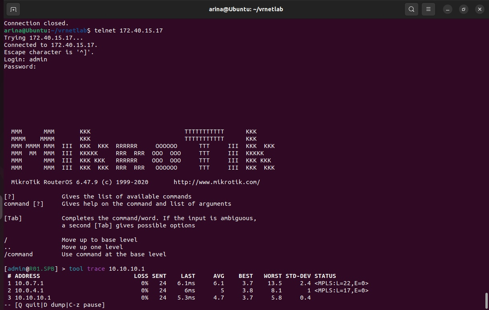
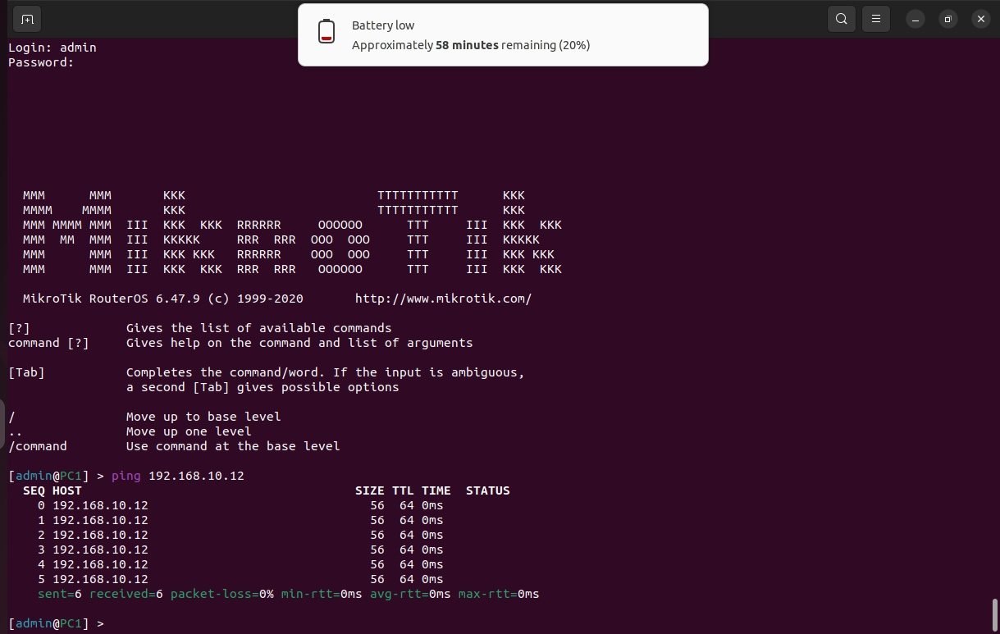
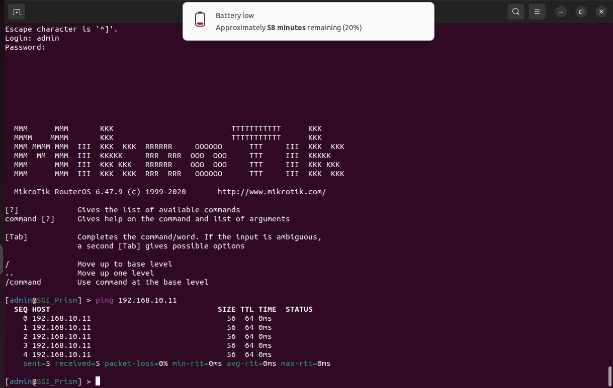

<p>University: [ITMO University](https://itmo.ru/ru/)</p>
<p></p>Faculty: [FICT](https://fict.itmo.ru)</p>
<p>Course: [Introduction in routing](https://github.com/itmo-ict-faculty/introduction-in-routing)</p>
<p>Year: 2023/2024</p>
<p>Group: K33202</p>
<p>Author: Gusevskaya Arina Eduardovna</p>
<p>Lab: Lab3</p>
<p>Date of create: 30.11.2023</p>
<p>Date of finished: 17.12.2023</p>

<p align="center"> <h2> Отчёт по лабораторной работе №3 "Эмуляция распределенной корпоративной сети связи, настройка OSPF и MPLS, организация первого EoMPLS"</h2> </p>
<p><b>Цель:</b> Изучить протоколы OSPF и MPLS, механизмы организации EoMPLS.
<p><b>Ход работы:</b>
<p>1. В ходе предыдущих лабораторных работ были выполнены все подготовительные шаги, ничего устанавливать не нужно</p>
<p>2. Чтобы не образовалось конфликта сетей, были остановлены и удалены контейнеры из предыдущей лабораторной работы</p>
<p align="center">
 
</p>
<p>3. Были прописаны те же топологии, но изменены устройства</p>
<h3>Выполнение</h3>
<p>1. Создадим сеть связи изображенную на рисунке 1 (из задания) в ContainerLab. Для этого пропишем топологию в файле lab3.yaml.
  
```
name: lab3

mgmt:
  network: third
  ipv4-subnet: 172.40.15.0/24

topology:

  nodes:
    R01.NY:
      kind: vr-ros
      image: vrnetlab/vr-routeros:6.47.9
      mgmt-ipv4: 172.40.15.12

    R01.LND:
      kind: vr-ros
      image: vrnetlab/vr-routeros:6.47.9
      mgmt-ipv4: 172.40.15.13

    R01.LBN:
      kind: vr-ros
      image: vrnetlab/vr-routeros:6.47.9
      mgmt-ipv4: 172.40.15.14
      
    R01.HKI:
      kind: vr-ros
      image: vrnetlab/vr-routeros:6.47.9
      mgmt-ipv4: 172.40.15.15
      
    R01.MSK:
      kind: vr-ros
      image: vrnetlab/vr-routeros:6.47.9
      mgmt-ipv4: 172.40.15.16
      
    R01.SPB:
      kind: vr-ros
      image: vrnetlab/vr-routeros:6.47.9
      mgmt-ipv4: 172.40.15.17

    SGI_Prism:
      kind: vr-ros
      image: vrnetlab/vr-routeros:6.47.9
      mgmt-ipv4: 172.40.15.18

    PC1:
      kind: vr-ros
      image: vrnetlab/vr-routeros:6.47.9
      mgmt-ipv4: 172.40.15.19

  links:
    - endpoints: ["R01.NY:eth3", "R01.LND:eth2"]
    - endpoints: ["R01.NY:eth4", "R01.LBN:eth2"]
    - endpoints: ["R01.LND:eth3", "R01.HKI:eth2"]
    - endpoints: ["R01.LBN:eth3", "R01.MSK:eth2"]
    - endpoints: ["R01.LBN:eth4", "R01.HKI:eth4"]
    - endpoints: ["R01.HKI:eth3", "R01.SPB:eth3"]
    - endpoints: ["R01.MSK:eth3", "R01.SPB:eth2"]
    - endpoints: ["R01.SPB:eth4", "PC1:eth2"]
    - endpoints: ["R01.NY:eth2", "SGI_Prism:eth2"]
```
<p>2. С помощью команды ```clab deploy --topo lab3.yaml``` развернем лабораторию. На выходе получим 8 контейнеров.
<p align="center">
 
</p> 
<p>3. Создадим схему связи, используя drawio
<p align="center">
 
</p>
<p>4. Перейдем к настройке оборудования
<p>Основные технологии:
<p><b>MPLS</b>  - применяется для ускорения передачи данных в сетях с помощью добавления labels(меток) к пакетам данных. При использовании происходит меньшая задержка и повышается пропускная способность.
<p><b>VPLS</b> - позволяет создавать виртуальные локальные сети VLANs на основе MPLS-сети. 
<p><b>EoMPLS</b> - используется для объединения локальных сетей в одну, что позволяет управлять трафиком более эффективно.
<p><b>MPLS LDP</b> - протокол, распределяющий labels.
<p><b>OSPF</b> - протокол маршрутизации, который используется для определения наиболее короткого пути между узлами в IP-сети.
<p>Подключимся к устройству через telnet.
<p align="center">
 
</p>
  
<h5>R01.NY</h5>

```
/interface bridge
add name=EoMPLS_bridge
add name=loopback
/interface vpls
add cisco-style=yes cisco-style-id=222 disabled=no l2mtu=1500 mac-address=02:73:6A:04:96:C5 name=EoMPLS remote-peer=10.10.10.6
/interface wireless security-profiles
set [ find default=yes ] supplicant-identity=MikroTik
/routing ospf instance
set [ find default=yes ] router-id=10.10.10.1
/interface bridge port
add bridge=EoMPLS_bridge interface=ether2
add bridge=EoMPLS_bridge interface=EoMPLS
/ip address
add address=172.31.255.30/30 interface=ether1 network=172.31.255.28
add address=10.0.0.1/30 interface=ether3 network=10.0.0.0
add address=10.0.2.1/30 interface=ether4 network=10.0.2.0
add address=10.10.10.1 interface=loopback network=10.10.10.1
/ip dhcp-client
add disabled=no interface=ether1
/mpls ldp
set enabled=yes transport-address=10.10.10.1
/mpls ldp interface
add interface=ether3
add interface=ether4
/routing ospf network
add area=backbone
/system identity
set name=R01.NY
```
<p>1. Cоздадим интерфейс loopback для настройки OSPF и MPLS. Добавим IP-адреса всем интерфейсам.
<p>2. Включим MPLS на роутере у тех интерфейсов, которые смотрят внутрь сети.
<p>3. Запустим динамическую маршрутизацию по OSPF.
<p>4. Настроим EoMPLS на интерфейсах, смотрящих наружу.
 
<h5>R01.LND</h5>

```
/interface bridge
add name=loopback
/interface wireless security-profiles
set [ find default=yes ] supplicant-identity=MikroTik
/routing ospf instance
set [ find default=yes ] router-id=2.2.2.2
/ip address
add address=172.31.255.30/30 interface=ether1 network=172.31.255.28
add address=10.0.1.2/30 interface=ether2 network=10.0.1.0
add address=10.0.3.1/30 interface=ether3 network=10.0.3.0
add address=2.2.2.2 interface=loopback network=2.2.2.2
/ip dhcp-client
add disabled=no interface=ether1
/mpls ldp
set enabled=yes transport-address=2.2.2.2
/mpls ldp interface
add interface=ether2
add interface=ether3
/routing ospf network
add area=backbone
/system identity
set name=R01.LND
```
Здесь и далее аналогично настроим OSPF, MPLS, интерфейсы и IP-адреса.

<h5>R01.LBN</h5>

```
/interface bridge
add name=loopback
/interface wireless security-profiles
set [ find default=yes ] supplicant-identity=MikroTik
/routing ospf instance
set [ find default=yes ] router-id=3.3.3.3
/ip address
add address=172.31.255.30/30 interface=ether1 network=172.31.255.28
add address=10.0.2.2/30 interface=ether2 network=10.0.2.0
add address=10.0.4.1/30 interface=ether3 network=10.0.4.0
add address=10.0.5.1/30 interface=ether4 network=10.0.5.0
add address=3.3.3.3 interface=loopback network=3.3.3.3
/ip dhcp-client
add disabled=no interface=ether1
/mpls ldp
set enabled=yes transport-address=3.3.3.3
/mpls ldp interface
add interface=ether2
add interface=ether3
add interface=ether4
/routing ospf network
add area=backbone
/system identity
set name=R01.LBN
```
<h5>R01.HKI</h5>

```
/interface bridge
add name=loopback
/interface wireless security-profiles
set [ find default=yes ] supplicant-identity=MikroTik
/routing ospf instance
set [ find default=yes ] router-id=4.4.4.4
/ip address
add address=172.31.255.30/30 interface=ether1 network=172.31.255.28
add address=10.0.3.2/30 interface=ether2 network=10.0.3.0
add address=10.0.6.1/30 interface=ether3 network=10.0.6.0
add address=10.0.5.2/30 interface=ether4 network=10.0.5.0
add address=4.4.4.4 interface=loopback network=4.4.4.4
/ip dhcp-client
add disabled=no interface=ether1
/mpls ldp
set enabled=yes transport-address=4.4.4.4
/mpls ldp interface
add interface=ether2
add interface=ether3
add interface=ether4
/routing ospf network
add area=backbone
/system identity
set name=R01.HKI
```
<h5>R01.MSK</h5>

```
/interface bridge
add name=loopback
/interface wireless security-profiles
set [ find default=yes ] supplicant-identity=MikroTik
/routing ospf instance
set [ find default=yes ] router-id=5.5.5.5
/ip address
add address=172.31.255.30/30 interface=ether1 network=172.31.255.28
add address=10.0.4.2/30 interface=ether2 network=10.0.4.0
add address=10.0.7.1/30 interface=ether3 network=10.0.7.0
add address=5.5.5.5 interface=loopback network=5.5.5.5
/ip dhcp-client
add disabled=no interface=ether1
/mpls ldp
set enabled=yes transport-address=5.5.5.5
/mpls ldp interface
add interface=ether2
add interface=ether3
/routing ospf network
add area=backbone
/system identity
set name=R01.MSK
```
<h5>R01.SPB</h5>

```
/interface bridge
add name=EoMPLS_bridge
add name=loopback
/interface vpls
add cisco-style=yes cisco-style-id=222 disabled=no l2mtu=1500 mac-address=02:81:EA:1D:D6:9A name=EoMPLS remote-peer=1.1.1.1
/interface wireless security-profiles
set [ find default=yes ] supplicant-identity=MikroTik
/routing ospf instance
set [ find default=yes ] router-id=6.6.6.6
/interface bridge port
add bridge=EoMPLS_bridge interface=ether4
add bridge=EoMPLS_bridge interface=EoMPLS
/ip address
add address=172.31.255.30/30 interface=ether1 network=172.31.255.28
add address=10.0.7.2/30 interface=ether2 network=10.0.7.0
add address=10.0.6.2/30 interface=ether3 network=10.0.6.0
add address=6.6.6.6 interface=loopback network=6.6.6.6
/ip dhcp-client
add disabled=no interface=ether1
/mpls ldp
set enabled=yes transport-address=6.6.6.6
/mpls ldp interface
add interface=ether2
add interface=ether3
/routing ospf network
add area=backbone
/system identity
set name=R01.SPB
```
Настроим аналогично роутеру R01.NY.

<h5>SGI Prism</h5>

```
/interface wireless security-profiles
set [ find default=yes ] supplicant-identity=MikroTik
/ip address
add address=172.31.255.30/30 interface=ether1 network=172.31.255.28
add address=192.168.10.11/24 interface=ether2 network=192.168.10.0
/ip dhcp-client
add disabled=no interface=ether1
/system identity
set name=SGI-Prism
```
<h5>PC1</h5>

```
/interface wireless security-profiles
set [ find default=yes ] supplicant-identity=MikroTik
/ip address
add address=172.31.255.30/30 interface=ether1 network=172.31.255.28
add address=192.168.10.12/24 interface=ether2 network=192.168.10.0
/ip dhcp-client
add disabled=no interface=ether1
/system identity
set name=PC1
```
Добавим статические ip-адреса

<h3>Таблица маршрутизации</h3>
<p align="center">
 
</p> 
<p align="center">R01.NY
 <p align="center">
 
</p> 
<p align="center">R01.MSK
<h3>Трассировка</h3>
<p align="center">
 
</p> 
<p align="center">SPB->NY
<h3>Проверка целостности сети</h3>
<p align="center">
 
</p> 
<p align="center">PC1 -> SGI_Prism
<p align="center">
 
</p> 
<p align="center">SGI_Prism -> PC1
 
<p><b>Вывод:</b> В ходе лабораторной работы были изучены протоколы OSPF и MPLS, а также механизмы организации EoMPLS.
