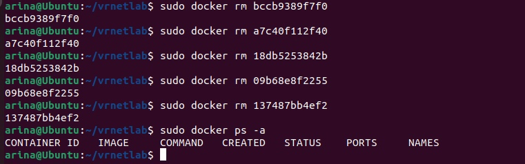
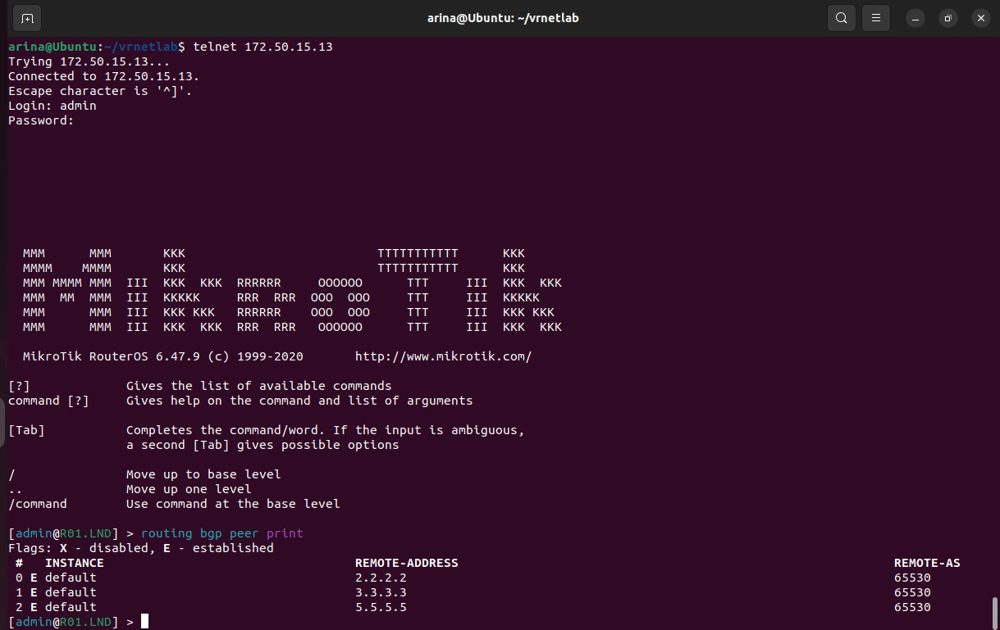
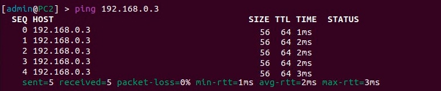

<p>University: [ITMO University](https://itmo.ru/ru/)</p>
<p></p>Faculty: [FICT](https://fict.itmo.ru)</p>
<p>Course: [Introduction in routing](https://github.com/itmo-ict-faculty/introduction-in-routing)</p>
<p>Year: 2023/2024</p>
<p>Group: K33202</p>
<p>Author: Gusevskaya Arina Eduardovna</p>
<p>Lab: Lab4</p>
<p>Date of create: 01.12.2023</p>
<p>Date of finished: 17.12.2023</p>

<p align="center"> <h2> Отчёт по лабораторной работе №4 "Эмуляция распределенной корпоративной сети связи, настройка iBGP, организация L3VPN, VPLS"</h2> </p>
<p><b>Цель:</b> Изучить протоколы BGP, MPLS и правила организации L3VPN и VPLS.
<p><b>Ход работы:</b>
<p>1. В ходе предыдущих лабораторных работ были выполнены все подготовительные шаги, ничего устанавливать не нужно</p>
<p>2. Чтобы не образовалось конфликта сетей, были остановлены и удалены контейнеры из предыдущей лабораторной работы</p>
<p align="center">
 
</p>
<p>3. Были прописаны те же топологии, но изменены устройства</p>
<h3>Выполнение</h3>
<p>1. Создадим сеть связи изображенную на рисунке 1 (из задания) в ContainerLab. Для этого пропишем топологию в файле lab4.yaml.
  
```
name: lab4

mgmt:
  network: statics
  ipv4-subnet: 172.20.15.0/24

topology:

  nodes:
    R01.NY:
      kind: vr-ros
      image: vrnetlab/vr-routeros:6.47.9
      mgmt-ipv4: 172.20.15.12

    R01.LND:
      kind: vr-ros
      image: vrnetlab/vr-routeros:6.47.9
      mgmt-ipv4: 172.20.15.13

    R01.LBN:
      kind: vr-ros
      image: vrnetlab/vr-routeros:6.47.9
      mgmt-ipv4: 172.20.15.14
      
    R01.HKI:
      kind: vr-ros
      image: vrnetlab/vr-routeros:6.47.9
      mgmt-ipv4: 172.20.15.15
      
    R01.SVL:
      kind: vr-ros
      image: vrnetlab/vr-routeros:6.47.9
      mgmt-ipv4: 172.20.15.16
      
    R01.SPB:
      kind: vr-ros
      image: vrnetlab/vr-routeros:6.47.9
      mgmt-ipv4: 172.20.15.17

    PC1:
      kind: linux
      image: alpine:latest
      mgmt-ipv4: 172.20.15.18

    PC2:
      kind: linux
      image: alpine:latest
      mgmt-ipv4: 172.20.15.19

    PC3:
      kind: linux
      image: alpine:latest
      mgmt-ipv4: 172.20.15.20

  links:
    - endpoints: ["R01.NY:eth2","PC2:eth1"]
    - endpoints: ["R01.LND:eth3","R01.NY:eth1"]
    - endpoints: ["R01.LBN:eth2","R01.LND:eth2"]
    - endpoints: ["R01.HKI:eth2","R01.LND:eth1"]
    - endpoints: ["R01.SPB:eth1","PC1:eth1"]
    - endpoints: ["R01.SPB:eth2","R01.HKI:eth1"]
    - endpoints: ["R01.HKI:eth3","R01.LBN:eth1"]
    - endpoints: ["R01.LBN:eth3","R01.SVL:eth1"]
    - endpoints: ["R01.SVL:eth2","PC3:eth1"]
```
<p>2. С помощью команды ```clab deploy --topo lab4.yaml``` развернем лабораторию. На выходе получим 9 контейнеров.
<p align="center">
 
</p> 
<p>3. Создадим схему связи, используя drawio
<p align="center">
 
</p>
<p>4. Перейдем к настройке оборудования
<h5>R01.NY</h5>

```
/interface bridge
add name=loopback
/interface wireless security-profiles
set [ find default=yes ] supplicant-identity=MikroTik
/routing bgp instance
set default router-id=5.5.5.5
/routing ospf instance
set [ find default=yes ] router-id=5.5.5.5
/ip address
add address=172.31.255.30/30 interface=ether1 network=172.31.255.28
add address=10.0.5.2/30 interface=ether2 network=10.0.5.0
add address=192.168.20.1/24 interface=ether3 network=192.168.20.0
add address=5.5.5.5 interface=loopback network=5.5.5.5
/ip dhcp-client
add disabled=no interface=ether1
/ip route vrf
add export-route-targets=65530:111 import-route-targets=65530:111 interfaces=ether3 \
    route-distinguisher=6530:111 routing-mark=VRF_DEVOPS
/mpls ldp
set enabled=yes transport-address=5.5.5.5
/mpls ldp interface
add interface=ether2
add interface=ether3
/routing bgp instance vrf
add redistribute-connected=yes routing-mark=VRF_DEVOPS
/routing bgp peer
add address-families=ip,l2vpn,l2vpn-cisco,vpnv4 name=peer5 remote-address=4.4.4.4 remote-as=\
    65530 update-source=loopback
/routing ospf network
add area=backbone
/system identity
set name=R01.NY
```
Настраиваем IP-адреса и интерфейсы в соответствии с топологией, MPLS, OSPF и BGP маршрутизацию.
<h5>R01.LND</h5>

```
/interface bridge
add name=loopback
/interface wireless security-profiles
set [ find default=yes ] supplicant-identity=MikroTik
/routing bgp instance
set default router-id=4.4.4.4
/routing ospf instance
set [ find default=yes ] router-id=4.4.4.4
/ip address
add address=172.31.255.30/30 interface=ether1 network=172.31.255.28
add address=10.0.2.2/30 interface=ether2 network=10.0.2.0
add address=10.0.4.2/30 interface=ether3 network=10.0.4.0
add address=10.0.5.1/30 interface=ether4 network=10.0.5.0
add address=4.4.4.4 interface=loopback network=4.4.4.4
/ip dhcp-client
add disabled=no interface=ether1
/mpls ldp
set enabled=yes transport-address=4.4.4.4
/mpls ldp interface
add interface=ether2
add interface=ether3
add interface=ether4
/routing bgp peer
add address-families=ip,l2vpn,l2vpn-cisco,vpnv4 name=peer2 remote-address=2.2.2.2 remote-as=\
    65530 route-reflect=yes update-source=loopback
add address-families=ip,l2vpn,l2vpn-cisco,vpnv4 name=peer4 remote-address=3.3.3.3 remote-as=\
    65530 route-reflect=yes update-source=loopback
add address-families=ip,l2vpn,l2vpn-cisco,vpnv4 name=peer5 remote-address=5.5.5.5 remote-as=\
    65530 update-source=loopback
/routing ospf network
add area=backbone
/system identity
set name=R01.LND
```
На внутренних роутерах настроим IP-адреса и интерфейсы в соответствии с топологией, MPLS и OSPF маршрутизацию. BGP маршрутизация будет включать RR кластер.
<h5>R01.SPB</h5>

```
/interface bridge
add name=loopback
/interface wireless security-profiles
set [ find default=yes ] supplicant-identity=MikroTik
/routing bgp instance
set default router-id=1.1.1.1
/routing ospf instance
set [ find default=yes ] router-id=1.1.1.1
/ip address
add address=192.168.10.1/24 interface=ether2 network=192.168.10.0
add address=10.0.1.1/30 interface=ether3 network=10.0.1.0
add address=1.1.1.1 interface=loopback network=1.1.1.1
/ip dhcp-client
add disabled=no interface=ether1
add disabled=no interface=ether2
add disabled=no interface=ether3
/ip route vrf
add export-route-targets=65530:111 import-route-targets=65530:111 interfaces=\
    ether2 route-distinguisher=65530:111 routing-mark=VRF_DEVOPS
/mpls ldp
set enabled=yes transport-address=1.1.1.1
/mpls ldp interface
add interface=ether2
add interface=ether3
/routing bgp instance vrf
add redistribute-connected=yes routing-mark=VRF_DEVOPS
/routing bgp peer
add address-families=ip,l2vpn,l2vpn-cisco,vpnv4 name=peer1 remote-address=\
    2.2.2.2 remote-as=65530 update-source=loopback
/routing ospf network
add area=backbone
/system identity
set name=R01.SPB
```
Настраиваем IP-адреса и интерфейсы в соответствии с топологией, MPLS, OSPF и BGP маршрутизацию.
<h5>R01.HKI</h5>

```
/interface bridge
add name=loopback
/interface wireless security-profiles
set [ find default=yes ] supplicant-identity=MikroTik
/routing bgp instance
set default router-id=2.2.2.2
/routing ospf instance
set [ find default=yes ] router-id=2.2.2.2
/ip address
add address=172.31.255.30/30 interface=ether1 network=172.31.255.28
add address=10.0.1.2/30 interface=ether2 network=10.0.1.0
add address=10.0.2.1/30 interface=ether3 network=10.0.2.0
add address=10.0.3.1/30 interface=ether4 network=10.0.3.0
add address=2.2.2.2 interface=loopback network=2.2.2.2
/ip dhcp-client
add disabled=no interface=ether1
add disabled=no interface=ether2
add disabled=no interface=ether3
add disabled=no interface=ether4
/mpls ldp
set enabled=yes transport-address=2.2.2.2
/mpls ldp interface
add interface=ether2
add interface=ether3
add interface=ether4
/routing bgp peer
add address-families=ip,l2vpn,l2vpn-cisco,vpnv4 name=peer1 remote-address=1.1.1.1 remote-as=\
    65530 update-source=loopback
add address-families=ip,l2vpn,l2vpn-cisco,vpnv4 name=peer2 remote-address=4.4.4.4 remote-as=\
    65530 route-reflect=yes update-source=loopback
add address-families=ip,l2vpn,l2vpn-cisco,vpnv4 name=peer3 remote-address=3.3.3.3 remote-as=\
    65530 route-reflect=yes update-source=loopback
/routing ospf network
add area=backbone
/system identity
set name=R01.HKI
```
<h5>R01.LBN</h5>

```
/interface bridge
add name=loopback
/interface wireless security-profiles
set [ find default=yes ] supplicant-identity=MikroTik
/routing bgp instance
set default router-id=3.3.3.3
/routing ospf instance
set [ find default=yes ] router-id=3.3.3.3
/ip address
add address=172.31.255.30/30 interface=ether1 network=172.31.255.28
add address=10.0.3.2/30 interface=ether2 network=10.0.3.0
add address=10.0.4.1/30 interface=ether3 network=10.0.4.0
add address=10.0.6.1/30 interface=ether4 network=10.0.6.0
add address=3.3.3.3 interface=loopback network=3.3.3.3
/ip dhcp-client
add disabled=no interface=ether1
/mpls ldp
set enabled=yes transport-address=3.3.3.3
/mpls ldp interface
add interface=ether2
add interface=ether3
add interface=ether4
/routing bgp peer
add address-families=ip,l2vpn,l2vpn-cisco,vpnv4 name=peer3 remote-address=2.2.2.2 remote-as=\
    65530 route-reflect=yes update-source=loopback
add address-families=ip,l2vpn,l2vpn-cisco,vpnv4 name=peer4 remote-address=4.4.4.4 remote-as=\
    65530 route-reflect=yes update-source=loopback
add address-families=ip,l2vpn,l2vpn-cisco,vpnv4 name=peer6 remote-address=6.6.6.6 remote-as=\
    65530 update-source=loopback
/routing ospf network
add area=backbone
/system identity
set name=R01.LBN
```
<h5>R01.SVL</h5>

```
/interface bridge
add name=loopback
/interface wireless security-profiles
set [ find default=yes ] supplicant-identity=MikroTik
/routing bgp instance
set default router-id=6.6.6.6
/routing ospf instance
set [ find default=yes ] router-id=6.6.6.6
/ip address
add address=172.31.255.30/30 interface=ether1 network=172.31.255.28
add address=10.0.6.2/30 interface=ether2 network=10.0.6.0
add address=192.168.30.1/24 interface=ether3 network=192.168.30.0
add address=6.6.6.6 interface=loopback network=6.6.6.6
/ip dhcp-client
add disabled=no interface=ether1
/ip route vrf
add export-route-targets=65530:111 import-route-targets=65530:111 interfaces=ether3 \
    route-distinguisher=65530:111 routing-mark=VRF_DEVOPS
/mpls ldp
set enabled=yes transport-address=6.6.6.6
/mpls ldp interface
add interface=ether2
add interface=ether3
/routing bgp instance vrf
add redistribute-connected=yes routing-mark=VRF_DEVOPS
/routing bgp peer
add address-families=ip,l2vpn,l2vpn-cisco,vpnv4 name=peer6 remote-address=3.3.3.3 remote-as=\
    65530 update-source=loopback
/routing ospf network
add area=backbone
/system identity
set name=R01.SVL
```
<h5>PC1</h5>

```
/interface wireless security-profiles
set [ find default=yes ] supplicant-identity=MikroTik
/ip address
add address=172.31.255.30/30 interface=ether1 network=172.31.255.28
add address=192.168.10.2/24 interface=ether2 network=192.168.10.0
/ip dhcp-client
add disabled=no interface=ether1
/system identity
set name=PC1
```
<h5>PC2</h5>

```
/interface wireless security-profiles
set [ find default=yes ] supplicant-identity=MikroTik
/ip address
add address=172.31.255.30/30 interface=ether1 network=172.31.255.28
add address=192.168.20.2/24 interface=ether2 network=192.168.20.0
/ip dhcp-client
add disabled=no interface=ether1
/system identity
set name=PC2
```
<h5>PC3</h5>

```
/interface wireless security-profiles
set [ find default=yes ] supplicant-identity=MikroTik
/ip address
add address=172.31.255.30/30 interface=ether1 network=172.31.255.28
add address=192.168.30.2/24 interface=ether2 network=192.168.30.0
/ip dhcp-client
add disabled=no interface=ether1
/system identity
set name=PC3
```
<h3>Проверка связности VRF</h3>
<h5>LDN</h5>
<p align="center">
 
</p> 
<p align="center">Состояние Established
<h3>Проверка VRF_DEVOPS таблиц<h3>
 <h5>NY</h5>
 <p align="center">
 
</p> 
 <h5>SPB</h5>
<p align="center">
 
</p> 
<h3>Изменение конфигурации</h3>
<h5>R01.SPB</h5>

```
/interface bridge
add name=VPLSb
/interface vpls
add disabled=no l2mtu=1500 mac-address=02:3D:7A:3F:4A:28 name=VPLS1 \
    remote-peer=5.5.5.5 vpls-id=10:0
add disabled=no l2mtu=1500 mac-address=02:07:2A:39:C2:02 name=VPLS2 \
    remote-peer=6.6.6.6 vpls-id=10:0
/interface bridge port
add bridge=VPLSb interface=ether2
add bridge=VPLSb interface=VPLS1
add bridge=VPLSb interface=VPLS2
``` 
1. Разберем VRF.
2. Настроим VPLS.
<h5>R01.NY</h5>

```
/interface bridge
add name=VPLSb
/interface vpls
add disabled=no l2mtu=1500 mac-address=02:74:16:82:73:59 name=VPLS1 \
    remote-peer=1.1.1.1 vpls-id=10:0
add disabled=no l2mtu=1500 mac-address=02:E7:AB:72:0D:02 name=VPLS3 \
    remote-peer=6.6.6.6 vpls-id=10:0
/interface bridge port
add bridge=VPLSb interface=ether3
add bridge=VPLSb interface=VPLS1
add bridge=VPLSb interface=VPLS3
```
<h5>R01.SVL</h5>

```
/interface bridge
add name=VPLSb
/interface vpls
add disabled=no l2mtu=1500 mac-address=02:40:AD:5D:2D:A8 name=VPLS2 \
    remote-peer=1.1.1.1 vpls-id=10:0
add disabled=no l2mtu=1500 mac-address=02:B2:2B:38:4E:AE name=VPLS3 \
    remote-peer=5.5.5.5 vpls-id=10:0
/interface bridge port
add bridge=VPLSb interface=ether3
add bridge=VPLSb interface=VPLS2
add bridge=VPLSb interface=VPLS3
```
<h5>PC1</h5>

```
/ip address
add address=192.168.0.1/24 interface=ether2 network=192.168.0.0
```
Настраиваем IP-адресацию в одной сети.
<h5>PC2</h5>

```
/ip address
add address=192.168.0.2/24 interface=ether2 network=192.168.0.0
```
<h5>PC3</h5>

```
/ip address
add address=192.168.0.3/24 interface=ether2 network=192.168.0.0
```
<h3>Проверка целостности сети</h3>
<p align="center">
 
</p> 
<p align="center">PC1 -> PC2
<p align="center">
 
</p> 
<p align="center">PC2 -> PC3
<p align="center">
 
</p> 
<p align="center">PC3 -> PC1
<p><b>Вывод:</b> В ходе лабораторной рабты были изучены протоколы BGP, MPLS и правила организации L3VPN и VPLS.
